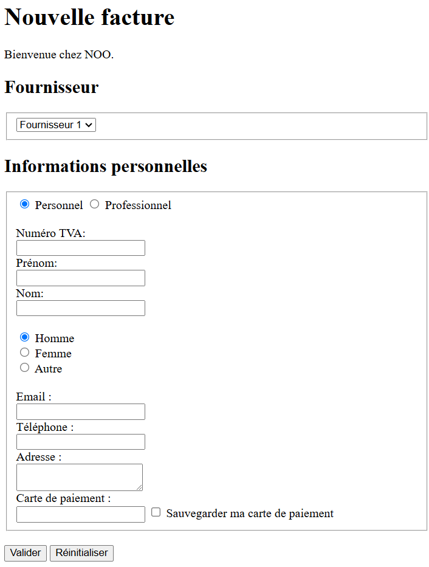
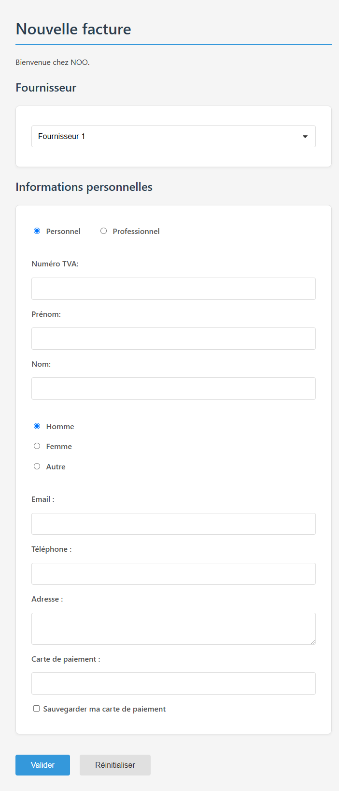

# Programmation WEB

Auteur : Pluquet Frédéric

## Objectifs

- Comprendre les bases du langage HTML
- Comprendre les bases du langage CSS
- Comprendre les bases du langage JavaScript

## Exercices HTML/CSS

Pour chaque exercice suivant, créez un fichier HTML et un fichier CSS (que vous pouvez inclure dans le fichier HTML) pour réaliser les tâches demandées. Ne mettez pas de CSS directement dans le fichier HTML, sauf si c’est demandé explicitement.

### Exercice 1 : Page web pour le jeu Mikado

Créez une page web pour une notice du jeu Mikado, en HTML contenant :

- Un titre clair dans l’onglet du navigateur
- L’usage des balises de titre `<H1>` et `<H2>`
- La séparation des paragraphes dans des balises différentes `
`
- L’intégration d’une ou plusieurs images en rapport avec le MIKADO, avec :
    - une image dans sa taille d’origine
    - une ou plusieurs images redimensionnées
- Quelques mots importants mis en gras et en italique

Rendez la page la plus esthétique possible en utilisant le CSS. Vous pouvez utiliser des couleurs, des polices, des bordures, des marges, des ombres, des dégradés, des images de fond, etc. pour rendre la page plus agréable à lire.

### Exercice 2 : Ensemble de pages web pour une aventure

Créez un ensemble de pages web. Le principe est simple, imaginez une aventure dans lequel le héros est le lecteur.

Dans chaque page, vous mettrez :

- Un titre
- Un fond
- Une image et un paragraphe qui décrit le lieu où se trouve le héros
- Un choix entre 2 ou 3 pages (ex. « Aller au nord » ou « prendre porte N 3 », etc.)
- Chaque choix sera un lien vers une autre page
- Chaque choix aura une icône ou une image cliquable

**Scénarisation** :

- Scénarisez vos pages web et prévoyez des choix plus complexes si la première page d’accueil du jeu demande un choix de personnage. Idéalement, prévoyez un schéma des liens de vos pages.
- Exemple : « Vous ne pouvez pas passer par ce passage car il est trop étroit. Cependant, si vous êtes un nain, vous pouvez emprunter ce passage. »

Le but est de créer un ensemble de liens permettant de « jouer » avec une ambiance graphique. Vous pouvez même ajouter quelques sons d’ambiance.

### Exercice 3 : Page de facture

Créer une page de type facture, en HTML, au format suivant :

- Un titre clair dans l’onglet du navigateur
- Le nom d’un client, son adresse
- La date
- Un titre contenant le mot « FACTURE »
- Un tableau, formaté comme suit :
    - Première ligne en gras, fond coloré
    - 5 colonnes : référence, nom produit, quantité, prix H.T., prix total H.T.
    - Quelques lignes de produit (remplissage)
    - Une ligne (et deux colonnes !) en gras avec le total TVA
    - Une ligne de remerciement d’achat dans votre magasin

### Exercice 4 : Formulaire de facture

Créez la page suivante en utilisant les balises `div`, `h1`, `h2`, `p`, `fieldset`, `form`, `select`, `hr`, `input`, `textarea`, `br`, …

### Exercice 5 : Style de la facture

Reprenez votre dernier exercice et ajoutez-y un fichier `style.css` pour en améliorer le style.

Ce fichier CSS permettra d’améliorer les différentes balises. La police utilisée doit être désormais `Segoe UI`.

Le résultat doit être le plus proche possible de l’image ci-dessous :

### Exercice 6 : Menu horizontal réactif

Créez un menu horizontal, contenant les items suivants, sous forme de blocs de 150 pixels (et qui passeront verticalement si la fenêtre se réduit).

- Accueil
- Agenda
- Articles
- Contact
- Mentions

Les items du menu seront réactifs au passage de la souris (changement de couleur ou couleur de fond).

Un clic sur un des menus permettra de déplacer la page courante vers la section choisie (ajoutez du texte aléatoire, en utilisant [Lipsum](https://www.lipsum.com/) par exemple, dans chaque section pour avoir une page assez grande et scrollable).

### Exercice 7 : Jeu CSS

Passez les 32 niveaux de [flukeout.github.io](https://flukeout.github.io/).

### Exercice 8 : Animation CSS et JS

Analysez le code contenu dans le dossier `solutions/exercice8`. Comprenez comment il fonctionne. Modifiez le code pour ajouter une animation de type `bounce` sur le texte `HELLO`.

### Exercice 9 : Recodage de la page connected.helha.be

Recodez le visuel de la page [https://connected.helha.be/login/index.php](https://connected.helha.be/login/index.php) avec un maximum de détails. Vous pouvez vous aider du code de la page existante pour comprendre comment les éléments sont placés et pour récupérer les différentes images qui la composent.

